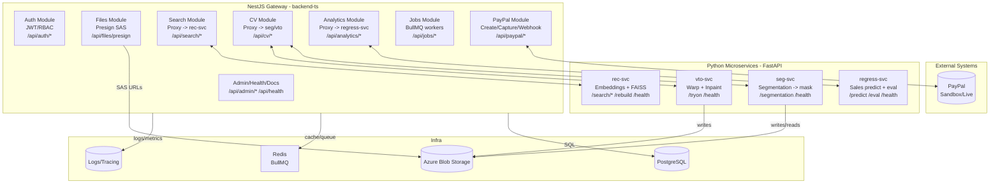
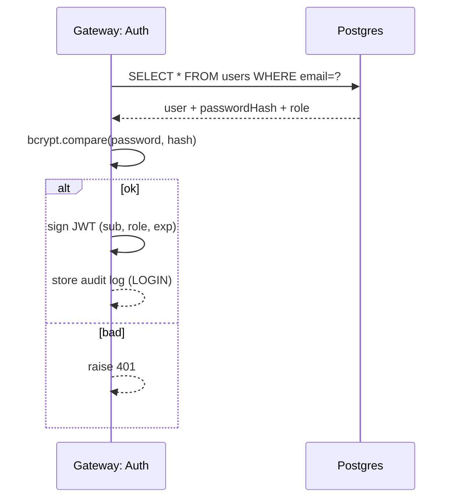
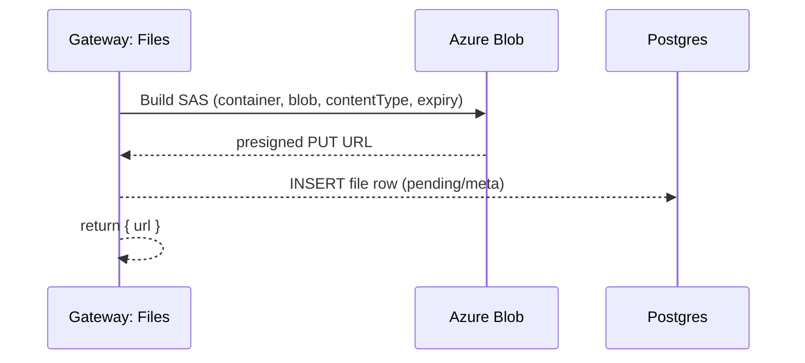
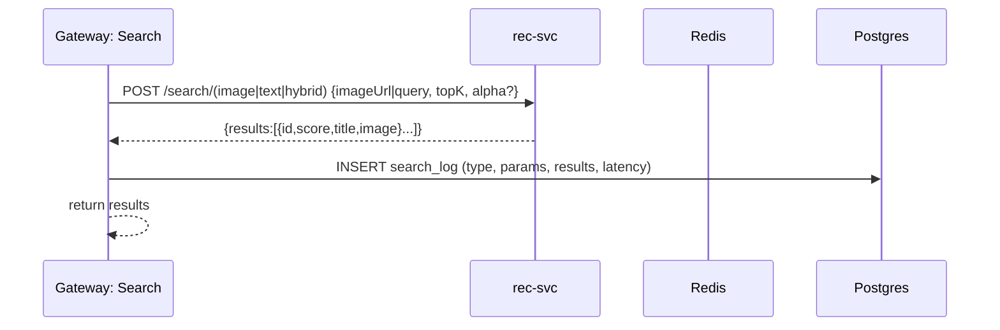
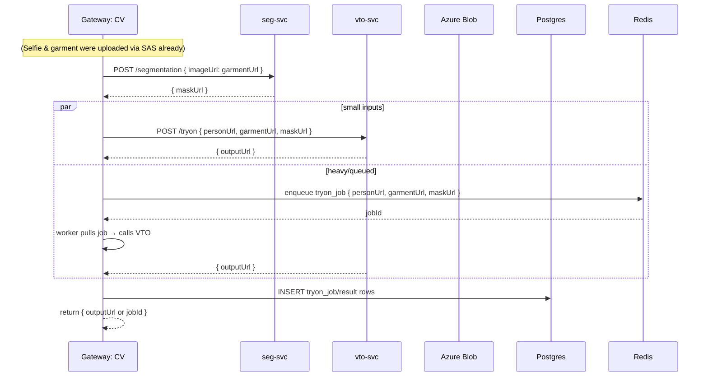
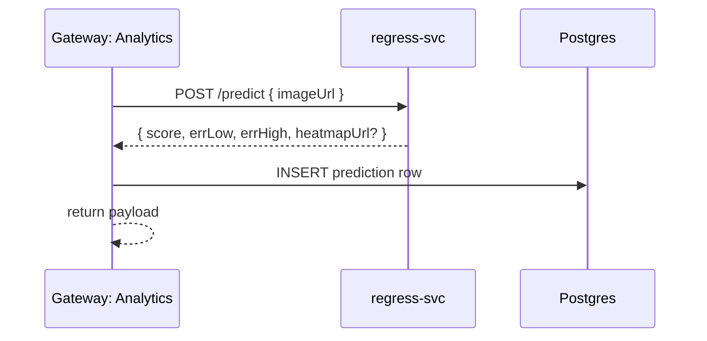
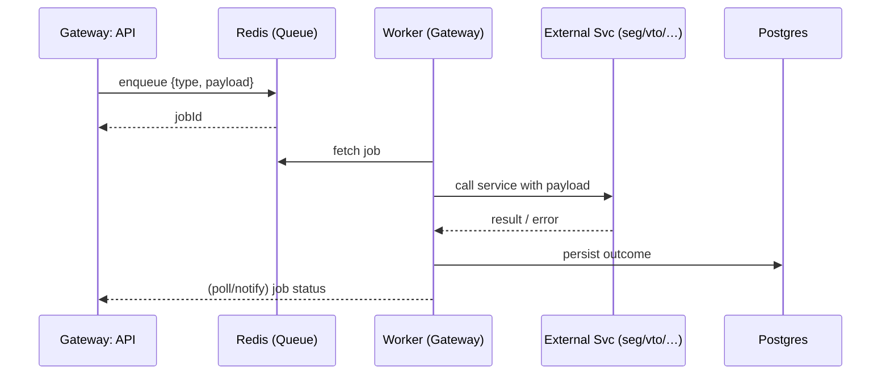
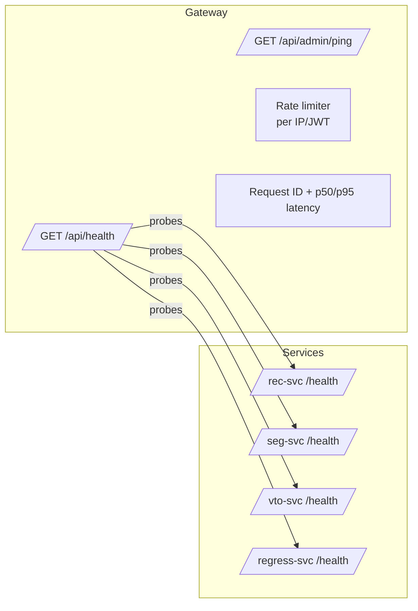

# AI Fashion Studio — Backend Flow Diagrams (S1 → Final)


## 1) Big Picture (components & data flow)



---

## 2) Auth (JWT) – Login/Verify



---

## 3) File Presign → Upload to Azure



---

## 4) Image/Text/Hybrid Search (Gateway → rec-svc)



---

## 5) Segmentation + Try-On Orchestration



---

## 6) Merchant Analytics (Gateway → regress-svc)



---

## 7) PayPal: Create → Approve → Capture (+Webhook)

```mermaid
sequenceDiagram
  participant GW as Gateway: PayPal
  participant PP as PayPal API
  participant P as Postgres

  Note over GW: getAccessToken() caches OAuth in memory (expires_in)

  GW->>PP: POST v2/checkout/orders { intent:CAPTURE, amount {value,currency} }
  PP-->>GW: { id, status:CREATED, links[approve] }
  GW-->>GW: return {id, approvalUrl}

  Note over GW: client opens approvalUrl and approves as sandbox buyer

  GW->>PP: POST v2/checkout/orders/{id}/capture
  PP-->>GW: { status:COMPLETED, purchase_units[0].payments.captures[] }
  GW->>P: INSERT payment {orderId, captureId, status, amount, currency, payload}
  GW-->>GW: return receipt

  %% Optional webhook (idempotent)
  PP-->>GW: POST /api/paypal/webhook (event)
  GW->>P: UPSERT payment/webhook_event; ensure idempotency
```

---

## 8) Jobs/Queues (BullMQ) for heavy tasks



---

## 9) Health/Observability/Rate-Limits



---

## 10) Data persistence touchpoints (what the Gateway writes)

- **PostgreSQL**
  - `users` (auth), `files` (any uploaded/generated asset),  
    `search_log`, `tryon_job`, `segmentation_result`, `prediction`,
    `payment`, `webhook_event`, `audit_log`, `index_version`.
- **Redis**
  - BullMQ queues (e.g., `tryon`, `rebuild-index`) + short-lived caches (OAuth token, presign receipts).
- **Azure Blob**
  - `uploads/...` selfies & garments, `masks/...`, `tryon/...`, `heatmaps/...`.

---

### Notes
- Keep this file at `/docs/backend-flow.md` in your repo.
- Update only the relevant diagram when you add/modify endpoints.
- For sprint demos, show the matching sequence diagram (Search, Try-On, PayPal).
